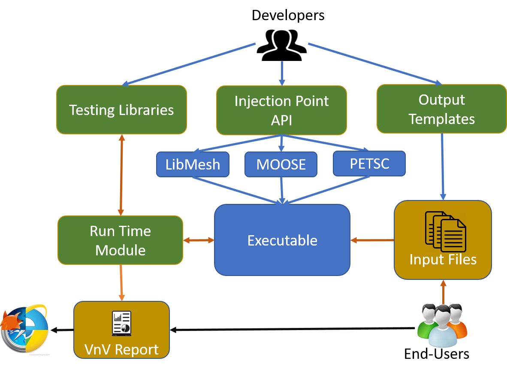

# VnV: A self documenting Testing Framework for In-situ Verification and Validation in HPC Applications.

TODO: This is old

 The VnV framework facilitates the development of explainable numerical simulation packages and applications. The goal is to make numerical simulations accessible to novice end-users by providing a uniform interface for configuring, running, and analyzing numerical simulations.  

*The VnV toolkit. Here, green boxes represent core functionalities. Developer interactions are shown in blue, runtime interactions are shown in orange and post-processing interactions are shown in black.*

The figure above uses the MOOSE tool-chain to show how developers and end-users will interact with the VnV framework. The first step is to define the injection points. These injection points will be placed at key locations of the code where testing can and should take place. Developers will also complete an output template describing the state of the simulation at each injection point. That specification will be used to populate the final VnV report.

The next step is to create a VnV test. The tests are developed in external libraries and hence, can be developed either by the developer of the simulation or by the end-user of the library. The core framework will also include a robust set of general purpose V&V tests. Each test will be accompanied by a markdown formatted template file. Like injection points, this markdown file will be used to describe the test and present the results. The VnV framework supports a custom markdown format that includes a range of data visualization techniques. We envision that the developers of a numerical simulation package will ship the library with hard-coded injection points and a set of custom V&V tests.

End-users will be able to generate a customized input configuration file for each executable. This configuration file will contain information about every injection point located in the call-graph of the simulation; including those in external third party libraries. After customizing that file, generating a VnV report is as simple as running the simulation.

Overall, once integrated into an application, the VnV framework will provide a simple mechanism for creating self verifying, self describing, explainable numerical simulations. This will significantly reduce the burden associated with V&V for end users, thereby increasing the usability of the tools for non-expert end-users. 
